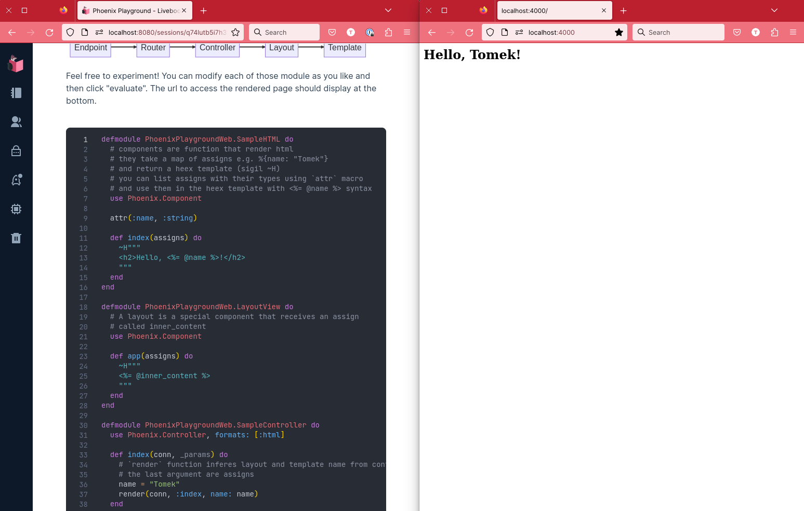

# Phoenix Playground

Get the taste of Phoenix web framework in just 5m
using Livebook - the interactive code notebook.



### How to use?

1. [Install livebook using your preferred method](https://github.com/livebook-dev/livebook/blob/main/README.md#installation)
2. Click "Open"
3. Select tab "From URL"
4. Paste the link to interactive notebook in this repo 
5. Click "Import"

```
https://raw.githubusercontent.com/tomekowal/phoenix-playground/main/phoenix-playground.livemd
```

Modify and evaluate the code to understand the basics. Enjoy! :)

### Why?

If you are using Linux you might not see why this is helpful.
But on Windows and Mac, the livebook installer is super easy to use.
You don't need to think about Erlang or Elixir versions to start coding.

For Phoenix, you don't need to learn about:
- installing archives,
- setting up new project,
- understanding mix,
- getting dependencies...

You can jump straight to playing with code to see if you enjoy the framework.

### Special thanks

@wojtekmach for `wojtekmach/mix_install_examples`. [Phoenix example](https://github.com/wojtekmach/mix_install_examples/blob/main/phoenix.exs) was my basis for the playground.

@Gazler who gave the idea of one file Phoenix app to Wojtek.

### Future work

Since the playground is just one file, it can be used for teaching tricky concepts on a working example. Let me know if you would like to see any concept explained in this way by opening an issue in this repository.

